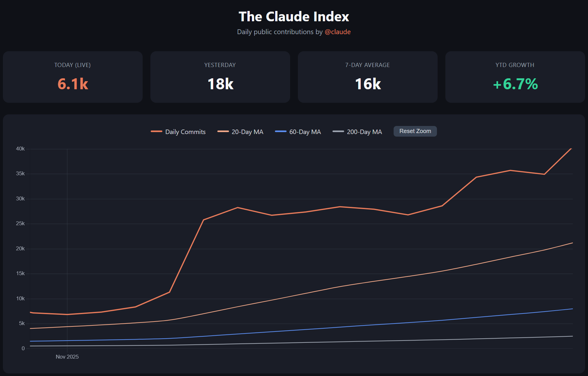

# The Claude Index

> Tracking daily public contributions by [@claude](https://github.com/claude) on GitHub.

## About

The Claude Index is a live dashboard that tracks the daily public commit activity of GitHub user [@claude](https://github.com/claude) — Anthropic's AI coding assistant. Data collection covers commits from 2024-01-01 to the present, with **1.9M+ total commits** tracked so far.

## Live Dashboard

**[https://dukbong.github.io/the-claude-index/](https://dukbong.github.io/the-claude-index/)**

## Metrics

| Metric | Description |
|--------|-------------|
| **Today (Live)** | Real-time commit count for today |
| **Yesterday** | Previous day's total commits |
| **7-Day Average** | Rolling weekly average |
| **YTD Growth** | Year-to-date growth percentage |
| **Moving Averages** | 20-day, 60-day, 200-day trend lines |

## How It Works

1. **GitHub Search API** queries commits authored by `@claude`
2. **GitHub Actions** runs hourly to update the data
3. Data is stored as JSON (`data/contributions.json`)
4. Interactive chart built with **Chart.js** (zoom/pan support)

## Tech Stack

- **Frontend:** HTML, CSS, JavaScript, Chart.js
- **Data Collection:** Python 3.12, GitHub Search API
- **Automation:** GitHub Actions (hourly cron)
- **Hosting:** GitHub Pages
