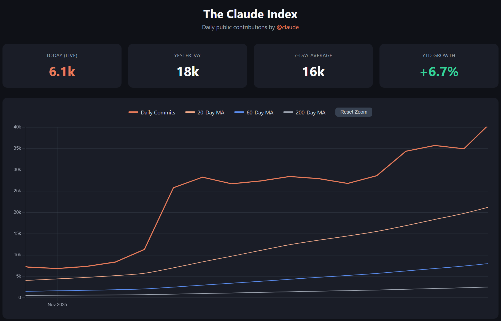

# The Claude Index

> Daily Claude-authored commits on GitHub, tracked via `Co-Authored-By: <noreply@anthropic.com>` trailer.

## About

The Claude Index is a live dashboard that tracks Claude-authored commits across all public GitHub repositories.

It searches for commits containing `noreply@anthropic.com` in their metadata (the `Co-Authored-By` trailer added by Claude Code), and displays daily counts on an interactive chart.

## Live Dashboard

**[https://dukbong.github.io/the-claude-index/](https://dukbong.github.io/the-claude-index/)**

## Metrics

| Metric | Description |
|--------|-------------|
| **Today** | Claude commits today |
| **Yesterday** | Claude commits yesterday |
| **Cumulative Total** | All-time total Claude commits |

## How It Works

1. **GitHub Search API** searches commits for `"noreply@anthropic.com"` with `author-date` filter
2. Daily commit counts are stored in `data/claude_commits.json`
3. Interactive chart is rendered with **Chart.js** (zoom/pan support)

## Scripts

- `python scripts/update_claude_commits.py` — Update today/yesterday + retry failed dates (max 7 API calls)
- `python scripts/initial_scrape_commits.py` — Backfill historical data from 2024-06-01

## Tech Stack

- **Frontend:** HTML, CSS, JavaScript, Chart.js
- **Data Collection:** Python 3.12, GitHub Search API
- **Automation:** GitHub Actions (every 2 hours)
- **Hosting:** GitHub Pages
